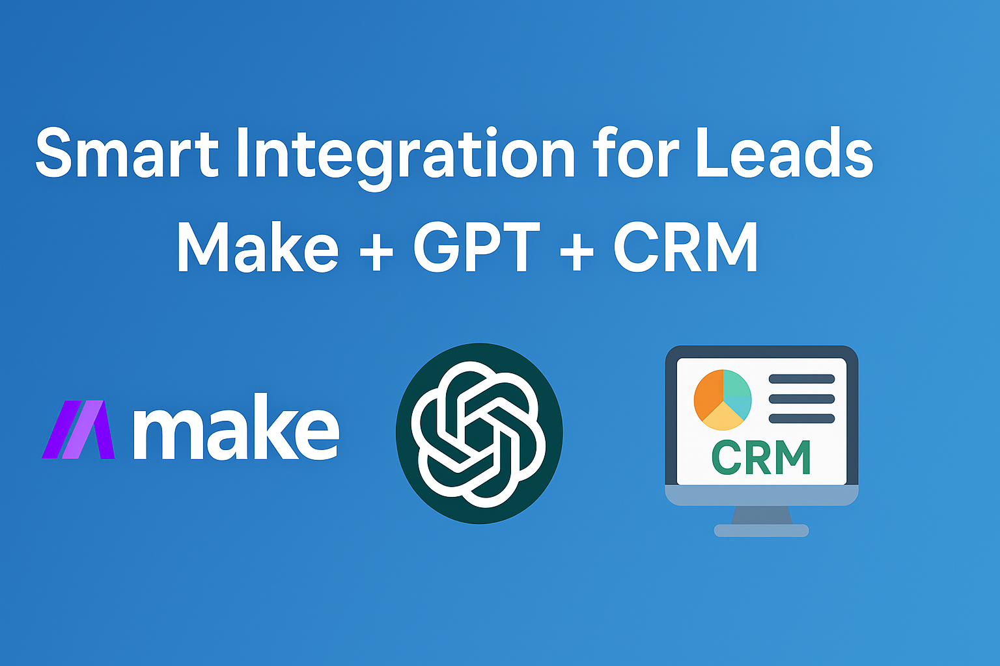
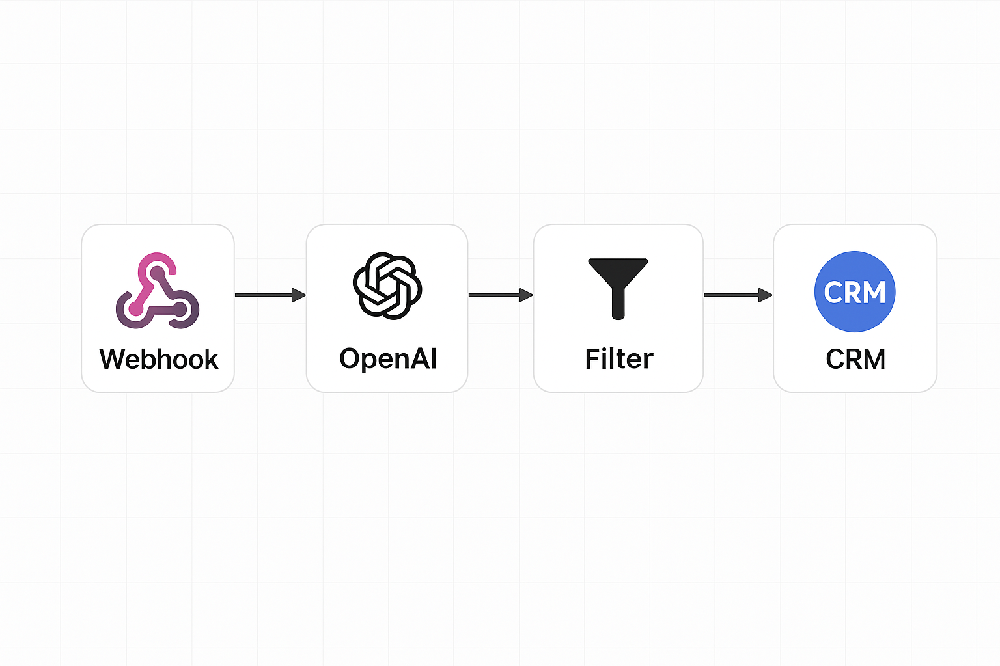
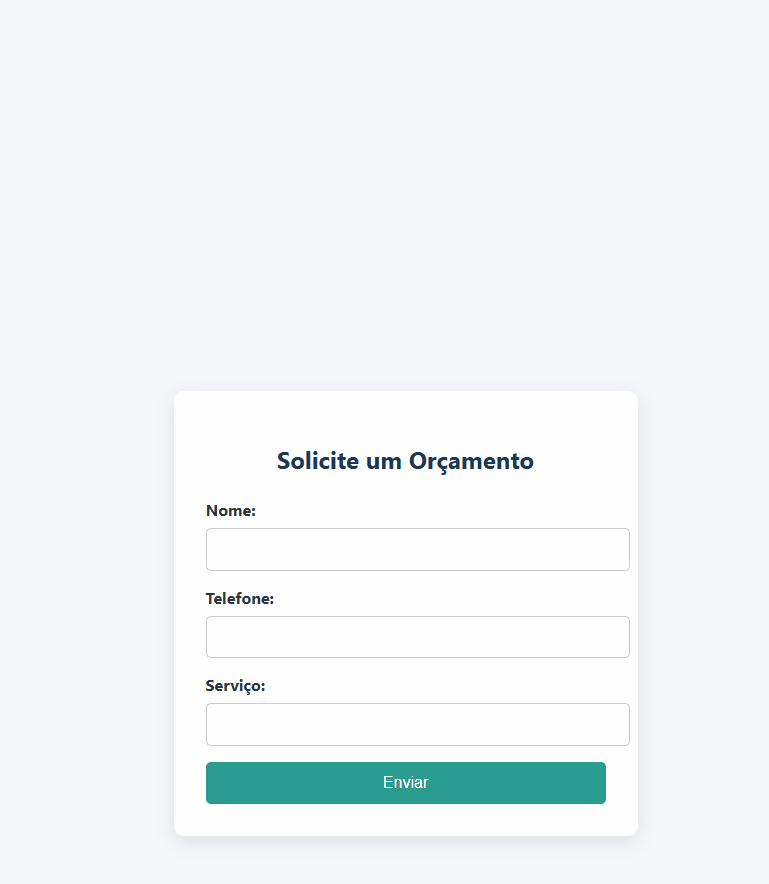

# 🤖 Smart Integration for Leads | Make + GPT + CRM


🇧🇷 [Versão em Português](README.md) | 📖 You’re reading the English version

---

> Smart automation with GPT-4 and Make for lead qualification, CRM integration (HubSpot), automatic email replies, and real-time notifications via Slack or WhatsApp.

---

This workflow goes beyond the basics: it **responds intelligently**, **organizes data**, and **notifies your team in real time** — all without writing a single line of code.  
Perfect for freelancers, agencies, e-commerce, SaaS businesses, and creators who want to scale with ease.

---

## Quick Summary 📌

- [Use Case](#use-case)
- [Features](#features)
- [Tools Used](#tools-used)
- [Try This Project](#try-this-project)
- [See It in Action](#see-it-in-action)
- [Live Demo](#live-demo)
- [Project Structure](#project-structure)
- [Contact Me](#contact-me)

---

## Use Case

1. 📝 A lead fills out the form  
2. 📊 The data goes straight into Google Sheets  
3. 🤖 AI generates a personalized response  
4. 📩 The lead receives an automated email  
5. 📲 Your team gets notified on Slack or WhatsApp  
6. 📇 The lead is saved in your CRM (HubSpot)

All of this **instantly**, with zero manual work. Magic? Almost. It’s AI + automation 😎

---

## Features

- Lead capture using Typeform / Google Forms  
- Auto-save to Google Sheets  
- Smart reply generation using OpenAI GPT-4  
- Email delivery via Gmail API  
- Notifications through Slack or WhatsApp  
- Final integration with HubSpot CRM  

---

## Tools Used

| Function               | Tool                      |
|------------------------|---------------------------|
| Automation             | Make / Zapier / n8n       |
| Lead Capture           | Typeform / Google Forms   |
| Storage                | Google Sheets             |
| Artificial Intelligence| OpenAI GPT-4              |
| Email Automation       | Gmail API                 |
| CRM                    | HubSpot                   |
| Notification           | Slack / WhatsApp          |

---

## Try This Project

1. Create a free account at [Make.com](https://www.make.com)  
2. Import the project’s [visual flow](docs/02_fluxo_automacao.md)  
3. Connect your Typeform or Google Form  
4. Set up your OpenAI, Gmail, and HubSpot accounts  
5. Run it and watch the magic happen in seconds! ✨

---

## See It in Action

🧠 **Automation Flow**



---

## Live Demo



---

## Project Structure

```plaintext
smart-integration-leads/
├── README.md
├── README.en.md
├── demo.gif
├── assets/
│   ├── banner-pt.png
│   ├── banner-en.png
│   ├── fluxo-integracao.png
│   ├── logo-openai.png
│   ├── logo-make.png
│   ├── logo-n8n.png
│   ├── logo-zapier.png
│   └── logo-hubspot.png
├── docs/
│   ├── 01_formulario.md
│   ├── 02_fluxo_automacao.md
│   └── 03_ia_gpt.md
├── scripts/
│   └── generate_email_response.py
└── .gitignore

```

---

## 📬 Contact Me
📧 [contact.neusam21@gmail.com](mailto:contact.neusam21@gmail.com)  
💼 Open for freelance work and collaborations  

Let’s automate the world! 😎💻🚀