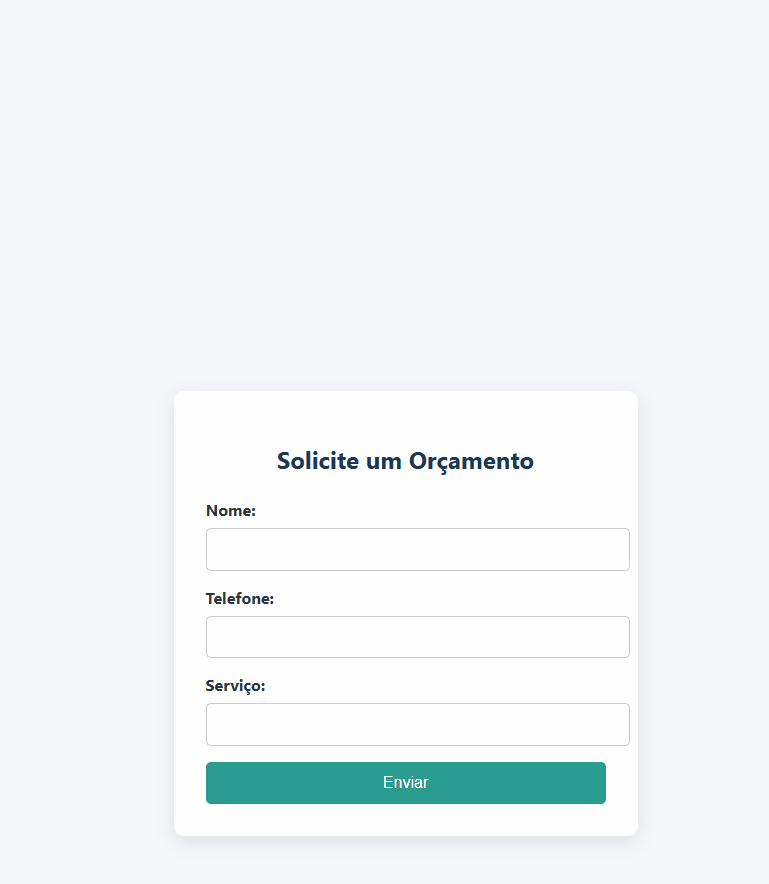

# 🤖 Smart Integration for Leads | Make + GPT + CRM

Automação 100% no-code para capturar, responder e organizar leads — tudo isso em segundos, sem digitar uma única linha de código.

> 🚀 Ideal para freelancers, agências, e-commerces, SaaS e criadores de conteúdo que querem escalar sem complicar.

---

## ✨ Prévia Visual

---

## 📌 Sumário Rápido

- [📄 Formulário de Leads](docs/01_formulario.md)
- [🔁 Fluxo no Make](docs/02_fluxo_automacao.md)
- [🤖 Integração com GPT-4](docs/03_ia_gpt.md)

---

## 💼 Cenário de Uso

1. 📝 Um lead preenche o formulário  
2. 📊 Os dados caem direto no Google Sheets  
3. 🤖 A IA gera uma resposta personalizada  
4. 📩 O lead recebe um e-mail automático  
5. 📲 A equipe é notificada no Slack ou WhatsApp  
6. 📇 O lead é salvo no CRM (HubSpot)

Tudo isso **de forma instantânea**, sem esforço manual. Magia? Quase. É IA com automação 😎

---

## ⚙️ Funcionalidades

- Captura de leads com Typeform / Google Forms  
- Armazenamento automático no Google Sheets  
- Resposta inteligente com OpenAI GPT-4  
- Envio de e-mail via Gmail API  
- Notificação por Slack ou WhatsApp  
- Integração final com HubSpot CRM  

---

## 🔌 Ferramentas Utilizadas

| Função                  | Ferramenta               |
|-------------------------|--------------------------|
| Automação               | Make / Zapier / n8n      |
| Captura de Leads        | Typeform / Google Forms  |
| Armazenamento           | Google Sheets            |
| Inteligência Artificial | OpenAI GPT-4             |
| E-mail Automático       | Gmail API                |
| CRM                     | HubSpot                  |
| Notificação             | Slack / WhatsApp         |

---

## 🎥 Veja em Ação

🔁 **Fluxo da Automação**  

📽️ **Demonstração Real**

---

## 📁 Estrutura do Projeto

- `README.md` — Documentação principal (pt-BR)  
- `README.en.md` — Versão em inglês  
- `assets/` — Imagens e logos  
  - `fluxo-integracao.png` — Fluxo visual da automação  
  - `demo-automacao.gif` — Demo animada  
  - `logo-openai.png`, `logo-make.png`, etc.  
- `docs/` — Tutoriais passo a passo  
  - `01_formulario.md`  
  - `02_fluxo_automacao.md`  
  - `03_ia_gpt.md`  
- `scripts/` — Códigos Python opcionais  
  - `generate_email_response.py` (em breve)

---

## 📬 Fale Comigo

📧 [contact.neusam21@gmail.com](mailto:contact.neusam21@gmail.com)  
💼 Aberta a colaborações e freelas

Vamos automatizar o mundo! 😎💻🚀
