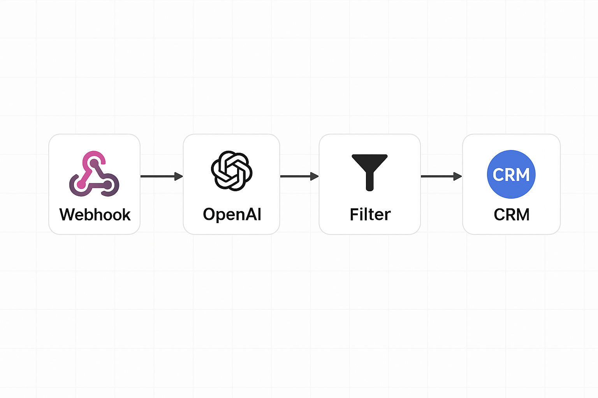

# 🤖 Smart Integration for Leads | Make + GPT + CRM


📖 [English Version](README.en.md) | 🇧🇷 Você está lendo a versão em Português

---

> Automação inteligente com GPT-4 e Make para qualificação de leads, integração com CRM (HubSpot), envio de e-mails automáticos e notificações via Slack ou WhatsApp.

---

Essa integração vai além do básico: ela **responde com inteligência**, **organiza os dados**, e **notifica sua equipe em tempo real** — tudo isso sem digitar uma única linha de código.  
Perfeita para freelancers, agências, e-commerces, SaaS e criadores de conteúdo que querem escalar sem complicar.

---

## Sumário Rápido 📌

- [Cenário de Uso](#cenario-de-uso)
- [Funcionalidades](#funcionalidades)
- [Ferramentas Utilizadas](#ferramentas-utilizadas)
- [Testar este Projeto](#testar-este-projeto)
- [🚀 Clone e Teste Localmente (Opcional)](#clone-e-teste-localmente-opcional)
- [Veja em Ação](#veja-em-acao)
- [Demonstração Real](#demonstracao-real)
- [Estrutura do Projeto](#estrutura-do-projeto)
- [Fale Comigo](#fale-comigo)
- [Em Desenvolvimento](#em-desenvolvimento)

---

## Cenário de Uso

1. 📝 Um lead preenche o formulário  
2. 📊 Os dados caem direto no Google Sheets  
3. 🤖 A IA gera uma resposta personalizada  
4. 📩 O lead recebe um e-mail automático  
5. 📲 A equipe é notificada no Slack ou WhatsApp  
6. 📇 O lead é salvo no CRM (HubSpot)

Tudo isso **de forma instantânea**, sem esforço manual. Magia? Quase. É IA com automação 😎

---

## Funcionalidades

- Captura de leads com Typeform / Google Forms  
- Armazenamento automático no Google Sheets  
- Resposta inteligente com OpenAI GPT-4  
- Envio de e-mail via Gmail API  
- Notificação por Slack ou WhatsApp  
- Integração final com HubSpot CRM  

---

## Ferramentas Utilizadas

| Função                  | Ferramenta               |
|-------------------------|--------------------------|
| Automação               | Make / Zapier / n8n      |
| Captura de Leads        | Typeform / Google Forms  |
| Armazenamento           | Google Sheets            |
| Inteligência Artificial | OpenAI GPT-4             |
| E-mail Automático       | Gmail API                |
| CRM                     | HubSpot                  |
| Notificação             | Slack / WhatsApp         |

---

## Testar este Projeto

1. Crie uma conta gratuita em [Make.com](https://www.make.com)  
2. Importe o [fluxo visual](docs/02_fluxo_automacao.md) do projeto  
3. Conecte com seu formulário Typeform ou Google Forms  
4. Configure sua conta do OpenAI, Gmail e HubSpot  
5. Execute e veja a mágica acontecer em segundos! ✨

---

## 🚀 Clone e Teste Localmente (Opcional)

Quer explorar o projeto na sua máquina? Clone e navegue pelas integrações de forma local:

```bash
git clone https://github.com/NeusaM21/smart-integration-leads.git
cd smart-integration-leads
```


---


## Veja em Ação

🧠 **Fluxo de Automação**

[🔍 Ver Fluxo Completo em Alta Resolução](assets/fluxo-integracao-final.png)




---

## Demonstração Real 


---

## Estrutura do Projeto

```plaintext
smart-integration-leads/
├── README.md
├── README.en.md
├── demo.gif
├── assets/
│   ├── banner-pt.png
│   ├── banner-en.png
│   ├── fluxo-integracao.png
│   ├── logo-openai.png
│   ├── logo-make.png
│   ├── logo-n8n.png
│   ├── logo-zapier.png
│   └── logo-hubspot.png
├── docs/
│   ├── 01_formulario.md
│   ├── 02_fluxo_automacao.md
│   └── 03_ia_gpt.md
├── scripts/
│   └── generate_email_response.py
└── .gitignore

```

---


## Fale Comigo

📬 E-mail profissional: [Enviar e-mail](mailto:contact.neusam21@gmail.com)  
🛡️ Disponível para freelas e colaborações!


---

## Em Desenvolvimento

🌱 Painel de acompanhamento com Streamlit  
🌱 Integração via chatbot (Telegram / WhatsApp Business API)  
🌱 Template visual para duplicação fácil


---

Vamos automatizar o mundo! 😎💻🚀
